# Service Account Impersonation Lab

## Lab URL
Pluralsight: https://app.pluralsight.com/hands-on/labs/cbd2a3b5-27fb-4c29-a6fa-19c0eef373ed?originUrl=https%3A%2F%2Fapp.pluralsight.com%2Fsearch%2F

## Overview
This infrastructure demonstrates service account impersonation in GCP, where a VM uses its attached service account to impersonate another service account with least-privilege access to specific resources.

**Lab Goal:** From a Compute Engine VM backend, mint a short-lived OAuth access token by impersonating a target service account, then use curl to prove the token can read/write only to Bucket A and fails on Bucket B.

## Architecture Diagram

```mermaid
graph TB
    subgraph "GCP Project"
        subgraph "Compute Engine"
            VM["Backend VM<br/>(ace-imp-vm)"]
        end
        
        subgraph "Service Accounts"
            BackendSA["Backend SA<br/>(ace-imp-backend)<br/>🔑 Attached to VM"]
            TargetSA["Target SA<br/>(ace-imp-gcs-access)<br/>🎯 Impersonated SA"]
        end
        
        subgraph "Cloud Storage"
            BucketA["Bucket A<br/>(ace-imp-a-xxx)<br/>✅ Accessible"]
            BucketB["Bucket B<br/>(ace-imp-b-xxx)<br/>❌ No Access"]
        end
        
        subgraph "IAM Credentials API"
            TokenService["generateAccessToken<br/>API"]
        end
    end
    
    %% Relationships
    VM -->|"1. Uses Identity"| BackendSA
    BackendSA -->|"2. Request Token<br/>(impersonate)"| TokenService
    TokenService -->|"3. Returns<br/>Short-lived Token"| BackendSA
    BackendSA -.->|"Has Permission<br/>serviceAccountTokenCreator"| TargetSA
    
    TargetSA -->|"4. Token used to<br/>Read/Write ✅"| BucketA
    TargetSA -.->|"5. Token attempt<br/>Access Denied ❌"| BucketB
    
    %% IAM Permissions
    TargetSA -.->|"roles/storage.objectViewer<br/>roles/storage.objectCreator"| BucketA
    
    style VM fill:#4285f4,color:#fff
    style BackendSA fill:#34a853,color:#fff
    style TargetSA fill:#fbbc04,color:#000
    style BucketA fill:#34a853,color:#fff
    style BucketB fill:#ea4335,color:#fff
    style TokenService fill:#9aa0a6,color:#fff
```



## Flow Explanation

### Step 1: VM Identity
- VM runs with `Backend SA` (ace-imp-backend) attached
- Backend SA has minimal permissions except impersonation rights

### Step 2: Token Impersonation
- Backend SA calls IAM Credentials API to impersonate `Target SA` (ace-imp-gcs-access)
- Backend SA has `roles/iam.serviceAccountTokenCreator` on Target SA
- API returns a short-lived OAuth 2.0 access token (typically 1 hour)

### Step 3: Access Bucket A (✅ Success)
- Target SA has `roles/storage.objectViewer` (read)
- Target SA has `roles/storage.objectCreator` (write)

### Step 4: Access Bucket B (❌ Denied)
- Target SA has NO permissions on Bucket B
- Demonstrates least-privilege principle

## Key Security Principles

1. **Least Privilege**: Target SA only has access to Bucket A
2. **Separation of Concerns**: Backend SA cannot directly access buckets
3. **Short-lived Credentials**: Impersonated tokens expire quickly
4. **Audit Trail**: All impersonation calls are logged in Cloud Audit Logs
5. **Explicit Denial**: Bucket B has no IAM bindings for Target SA

## How To Run

```sh
# Clean and setup Terraform authentication
gcloud auth application-default revoke # Clean ADC creds for Terraform
gcloud auth application-default login # for Terraform or ADC Auth
gcloud config set project playground-s-xxxx
export GOOGLE_PROJECT=$(gcloud config get project)

# Change the region according the LAB in variables.tf
./deploy-infra.sh test_impersonate_sa plan
./deploy-infra.sh test_impersonate_sa apply

# Setup gcloud authentication (if needed)
gcloud auth revoke --all  # Clean SDK creds
gcloud auth login # for gcloud commands or SDK Auth
gcloud config set compute/region xxxx
gcloud config set compute/zone xxxx-x
```

## Testing

### SSH into the VM
```sh
gcloud compute ssh --zone "us-central1-a" "ace-imp-vm" --project "creating-and-150-75ddacfe"
```

### Mint Impersonated Token
**Important:** Impersonate `ace-imp-gcs-access`, NOT `ace-imp-backend` (which is your current identity)
```bash
PROJECT_ID=$(gcloud config get project)
TOKEN=$(gcloud auth print-access-token \
  --impersonate-service-account="ace-imp-gcs-access@${PROJECT_ID}.iam.gserviceaccount.com")
```

### Test Bucket A - List Objects (✅ Should Succeed)
```bash
curl -H "Authorization: Bearer $TOKEN" \
  "https://storage.googleapis.com/storage/v1/b/ace-imp-a-${PROJECT_ID}/o"
```

### Test Bucket A - Upload Object (✅ Should Succeed)
```bash
echo "test content" | curl -X POST -H "Authorization: Bearer $TOKEN" \
  -H "Content-Type: text/plain" \
  --data-binary @- \
  "https://storage.googleapis.com/upload/storage/v1/b/ace-imp-a-${PROJECT_ID}/o?uploadType=media&name=test.txt"
```

### Test Bucket B - List Objects (❌ Should Fail with 403)
```bash
curl -H "Authorization: Bearer $TOKEN" \
  "https://storage.googleapis.com/storage/v1/b/ace-imp-b-${PROJECT_ID}/o"
```

Expected response: `403 Forbidden - Access denied`